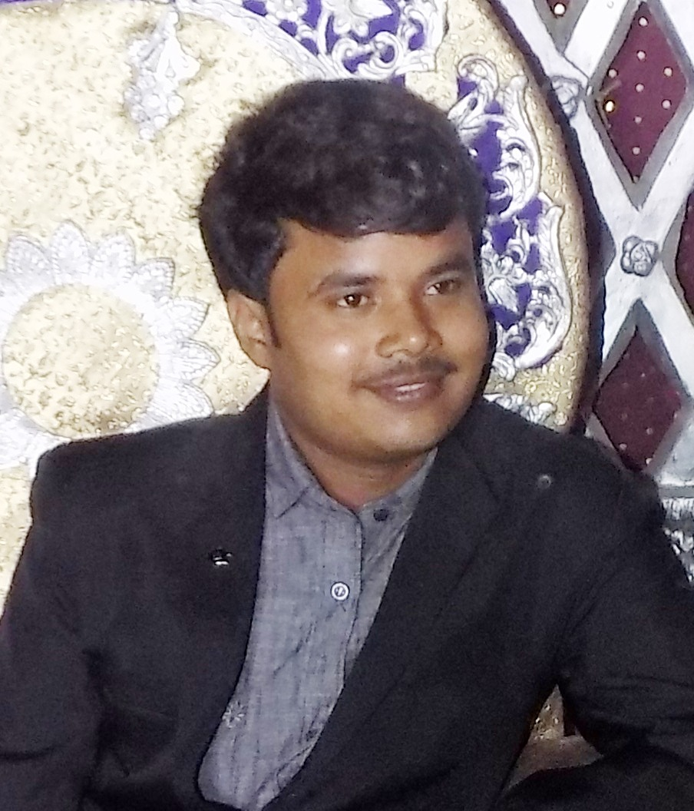

## Overview

- Running a medical business in home town Barauli.
- Annual Income: 12 LPA
- Highest Degree: Graduation
- Diet: Prefer Vegetarian
- Skin: Fair
- Drink: Never
- Personality: Simple

## Beliefs

- Hindu
- Caste: Kushwaha
- Manglik: No

# About Me

DOB: Dec, 1995 \
Height: 5 feet 4 inches \
Place of Birth: Barauli, Gopalganj \
Mother Tongue: Bhojpuri and Hindi \

I belong to a well-mannered middle-class Kushwaha family and strongly consider Hindu culture, rituals & holds an open-minded personality. I never drink, smoke and take any kind of intoxication. I'm affectionate, kind-hearted, caring, happy & believes in hardworking and creativity. I run a business on my own since last8 years. My hobbies are watching documentaries and learn new things.  

## Education
* High School, 1st Div, from BSEB, PAT
* Higher Secondary, 1st Div, from BSES, PAT
* Bachelor of Science (Zoology Hon.), 1st Div, JPU
* DElEd, NIOS

## Family Details
**Father**: Rajeshwar Prasad Verma, Lecturer (Retd.) Pt. Deendayal Upadhyaya College, Khajuria \
**Mother**: Geeta Devi, Govt. Teacher (Retd.) \
**Family-lives-in**: Barauli, Gopalganj \
**Siblings**: 3 \
**Elder Siblings**: 
  - Vijaya Bharti (Married), Teacher
  - Sandeep Kumar (Married), Technical Architect
  - Ajya Bharti, Teacher

## Contact
Contract: 9939429760

Thanks,
 Akashdeep Verma
